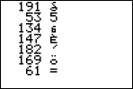

# A Forth for the TI-83+/TI-84+

Hi!  This is an ongoing project to bring a Forth to the TI-83+/TI-84+
calculator series.

## Why TI-83+/TI-84+?
This is a calculator that is more or less ubiquitous among high school
students throughout the world.  It's not going extinct anytime soon
(expect perhaps to newer models such as the TI-84 CE).  They're solid
calculators, but they have notable disadvantages.  You can't really
customize it.  There's no REPL to define procedures or perform tasks.
Variables are limited... the list goes on.  The TI calculators are the
microcomputers of today; so it makes sense to learn it at its lowest
levels---starting with assembly.

## Why Forth?
Assembly is painful to program in.  Programs crash at the slightest
hint of error, without rhyme or reason.  There's really no way to make
an interactive REPL without creating the READ, EVAL and PRINT parts of
it.

Wouldn't it be great to have a programming language on the
TI-83+/TI-84+ that's much faster than TI-BASIC but easier to
understand and as low level as assembly?  Forth is just that.  (read
_Starting FORTH_ for an excellent introduction to Forth).  It's low
level, it's simple, but most importantly it's _easy to type_,
especially when you're on a calculator with a non-QWERTY keyboard.  It
is a very powerful language, allowing you to do things like change the
syntax of the language itself.  `IF`, `WHILE`, `CONSTANT`
etc. statements are all implemented in Forth!  Think of it as a
untyped C with a REPL and the lower of Lisp macros.

It's also easy to implement incrementally, testing as you go along.  Once
I/O is done, the rest of Forth can be implemented in itself.
## Requirements
- [spasm-ng Z80 assembler](https://github.com/alberthdev/spasm-ng)
  - If you're on a Mac you may need to run the following commands.
  - Compile the assembler with `make` (check required packages and so
    on).
- A TI-84 calculator!
  - I haven't tested this program on any emulator.

```shell
brew install openssl
cd /usr/local/include
ln -s ../opt/openssl/include/openssl .
```

## Building
Once you have compiled spasm-ng, copy the executable into the same
directly as this assembly file.  Also make sure to copy the `inc/`
directory from the spasm-ng repository.  Once that's done, run:
```shell
./spasm -T forth.asm forth.8xp
```
The `-T` option is useful for debugging macro expansion, it's
optional.

## Features
- 16-bit Forth on a 8-bit chip
- Direct-threaded
- Programs are lists of 16-bit addresses
- Takes advantage of system calls such as `_GetKey`, `_PutC` and more
  to come (such as drawing pixels!)
## Example Program
```asm
prog:
        .dw key_ascii, dup, emit             ;; Steps 1-3
        .dw lit, 0, eql, zbranch, -14, done  ;; Steps 4-5
```

Here's what it does (stack shown in parentheses).
1. Get a key from the user as an ASCII code. (a)
2. Duplicate it. (a a)
3. Print the top of the stack (a)
4. Push the literal 0 onto the stack (a 0), and check if the top two
   elements are equal.
5. If they're not equal, `eql` returns `0`, which means we branch back
   14 bytes (7 instructions of 2 bytes each) to `key_ascii`, otherwise
   we're done.

### Screenshot


## Design Notes
### Use of Macros
Judicious use of macros has greatly improved readability of the code.
This was directly inspired by the _jonesforth_ implementation (see
Reading List).
### Register Allocation
One notable features of this Forth is the use of a register to keep
track of the top element in the stack.

| Z80 Register | Forth VM Register             |
| :---:        | :---:                         |
| DE           | Instruction pointer (IP)      |
| HL           | Working register (W)          |
| BC           | Top of stack (TOS)            |
| IX           | Return stack pointer (RSP)    |
| SP           | Parameter stack pointer (PSP) |
### Reading List
Documentation can vary from very well-documented to resorting to
having to read the source code of `spasm-ng` to figure out how
`#macro` worked.  See examples such as `defcode` and `defword`.  I
couldn't make `defconst` or `defvar`, however, but this was fixed by
writing it out manually.

- [General Z80 guide](http://jgmalcolm.com/z80/#advanced)
- [Moving Forth](http://www.bradrodriguez.com/papers/moving1.htm)
- [Learn TI-83 Plus Assembly In 28 Days](http://tutorials.eeems.ca/ASMin28Days/welcome.html)
- [KnightOS Kernel](https://github.com/KnightOS/kernel)
- [Starting FORTH](https://www.forth.com/starting-forth/)

## To be Implemented
- [ ] Ability to read/write programs
- [ ] Split the source into different files!
- [ ] User input
  - [ ] String reading routines
  - [ ] Number reading routines
- [ ] Output
  - [ ] Displaying strings
- [ ] Proper support for compile/interpret mode
- [ ] Assembler to convert Forth words into `.dw` data segments to be
pasted into the program.
- [ ] Ability to switch to a "plot"
  - [ ] So you may want to plot something and still go back to the
        REPL when needed.

