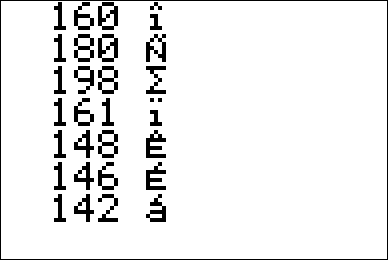
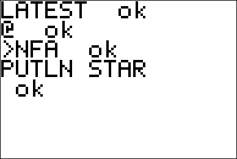
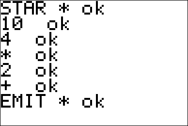
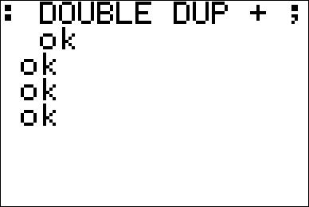
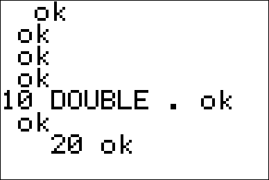

# A Forth for the TI-84+

Hi!  This is an ongoing project to bring a Forth to the TI-84+
calculator series.

## Why TI-84+?
This is a calculator that is more or less ubiquitous among high school
and university students throughout the world.  It's not going extinct
anytime soon (expect perhaps to newer models such as the TI-84 CE).
But let's face it.  TI-BASIC is not a nice language; it's slow and
suffers from lack of low-level bindings.  There's no REPL.  We want a
language that gives the programmer the full power of the
calculator—treating it as the computer it is.  In fact people already
do, by writing assembly programs, but assembly has its share of
disadvantages.

## Why Forth?
Assembly is painful to program in.  Programs crash at the slightest
hint of error.  Development is a slow process, and you have to keep
reinventing the wheel with each program.

Wouldn't it be great to have a programming language on the TI-84+
that's much faster than TI-BASIC but easier to understand and as low
level as assembly?  Forth is just that.  (read _Starting FORTH_ for an
excellent introduction to Forth).  It's low level, it's simple, but
also _easy to type_, especially when you're on a calculator with a
non-QWERTY keyboard.  It is a very powerful language, allowing you to
do things like change the syntax of the language itself.  `IF`,
`WHILE`, `CONSTANT` etc. statements are all implemented in Forth!
Think of it as a untyped C with a REPL and the power of Lisp macros.

It's also easy to implement incrementally, with continuous testing.
In fact, once the base REPL was implemented, most of the programming
and testing happened _on_ the calculator itself!

## How do I get it?
### Requirements
- [spasm-ng Z80 assembler](https://github.com/alberthdev/spasm-ng)
  - If you're on a Mac you may need to run the following commands.
```shell
brew install openssl
cd /usr/local/include
ln -s ../opt/openssl/include/openssl .
```  
  - Compile the assembler with `make` (check required packages and so
    on).
- [TI Connect CE](https://education.ti.com/en/products/computer-software/ti-connect-ce-sw)
- A TI-84+ calculator!
  - Should work on a TI-83+ as well, but I don't have one so please
    report bugs if you find them.
- (Optional) A 2.5 mm to 3.5 mm audio cable to connect the I/O port
  with a speaker.
## Building
Once you have compiled `spasm-ng`, copy `forth.asm` into the cloned
folder.  Then run:

```shell
./spasm forth.asm forth.8xp
```
Flash `forth.8xp` to your calculator.  Make sure there's enough space
and that you have backed up your calculator!  An easy way to back up
RAM contents is by creating a group, refer to the manual on how to do
this.

## Loading Forth Programs onto the calculator
To convert `hello.fth` into a list of bytes, run.
```shell
hexdump -e '".db "16/1 "$%02x, " "\n"' hello.fth | sed 's/$  ,/$00,/g' | sed 's/.$//' | sed 's/$0a/$20/g'
```

## Features
- A 16-bit Forth on a 8-bit chip
- Contains 171 words (and counting) for everything from memory
  management to drawing pixels, de-compilation and even playing sounds
  over the I/O port.
- Support for writeback.  Use `SIMG` (save image) and `LIMG` (load
  image) to save the words you've defined in a session.

## Example Programs
See `programs/` for program samples, including practical ones.

## Available Words
```text
EXIT FOO BAR DUP + - AND OR XOR << >> INVERT DROP SWAP OVER ROT -ROT
2DROP 2DUP 2SWAP 1+ 1- 4+ 4- >R R> RDROP LIT LITSTR TELL STRLEN STRCHR
!  @ +!  -!  C!  C@ C@C!  CMOVE EXECUTE BASE STATE LATEST SP0 [ ] ?SE
HERE DOCOL BUF BUFSZ WBUF WBUFSZ RP0 H0 F_IMMED F_HIDDEN F_LENMASK SCR
PLOTSS ' , SP@ SP!  RP@ RP!  BRANCH 0BRANCH ?DUP = <> >= <= < > 0=
RAND ASK KEY KEYC EMIT .  ?  AKEY TO_ASCII * /MOD 0 1 2 3 4 5 6 7 8 9
10 TS SPACE CR AT-XY PUTS PUTLN GETS GETC UNGETC WORD IMMED?  IMMED
>NFA >CFA STR= FIND WB USED SIMG LIMG >DFA CREATE DOCOL_H : ; PAGE
HIDDEN ?HIDDEN MOD / NEGATE TRUE FALSE NOT LITERAL NIP TUCK ID.  HIDE
IF THEN ELSE BEGIN UNTIL AGAIN WHILE REPEAT CHAR (COMP) CONST ALLOT
CELLS RECURSE VAR DO LOOP +LOOP FORGET '0' '9' WITHIN NUM?  NUM CFA>
PICK SEE WORDS CASE OF ENDOF ENDCASE I SMIT PLAY PLOT GETP DARKP TOGP
LITP WR PN BYE STAR
```

## Screenshots
### TI-84+ inside


### Combine words in powerful, practical ways.
Combine low-level memory words with drawing words and user input words
to create an arrow-key scrollable screen for viewing RAM memory.  See
the 20 (or less) lines of code at `programs/memview.fs`.



### An interactive REPL


### Define new words...


### ...and use them.



## Design Notes
### Use of Macros
Judicious use of macros has greatly improved readability of the code.
This was directly inspired by the _jonesforth_ implementation (see
Reading List).
### Register Allocation
One notable feature of this Forth is the use of a register to keep
track of the top element in the stack.

| Z80 Register | Forth VM Register             |
| :---:        | :---:                         |
| DE           | Instruction pointer (IP)      |
| HL           | Working register (W)          |
| BC           | Top of stack (TOS)            |
| IX           | Return stack pointer (RSP)    |
| SP           | Parameter stack pointer (PSP) |
### Reading List
Documentation can vary from very well-documented to resorting to
having to read the source code of `spasm-ng` to figure out how
`#macro` worked.  See examples such as `defcode` and `defword`.  I
couldn't make `defconst` or `defvar`, however, but this was fixed by
writing it out manually.

- [General Z80 guide](http://jgmalcolm.com/z80/#advanced)
- [Moving Forth](http://www.bradrodriguez.com/papers/moving1.htm)
- [Learn TI-83 Plus Assembly In 28 Days](http://tutorials.eeems.ca/ASMin28Days/welcome.html)
- [KnightOS Kernel](https://github.com/KnightOS/kernel)
- [Starting FORTH](https://www.forth.com/starting-forth/)
- [Jonesforth](http://git.annexia.org/?p=jonesforth.git)

## To be Implemented
- [x] Ability to read/write programs
  - [x] `WB` word to writeback ~~2048~~ 400 (see *Current Limitations*)
         bytes of data starting from the address of `SCRATCH`.
  - [x] Ability to "execute" strings (so that programs can be
        interpreted).
- [x] User input
  - [x] String reading routines
  - [x] Number reading routines (possible with `programs/number.fs`)
- [x] Output
  - [x] Displaying strings
- [x] Proper support for compile/interpret mode
- [x] Assembler to convert Forth words into `.dw` data segments to be
pasted into the program.
- [x] Ability to switch to a "plot"
- [x] REPL
  - [x] Basic Read/Eval/Print/Loop
  - [x] Allowing more than one word at a time input
  - [x] Respect hidden flag to avoid infinite looping. (`:` makes the
        word hidden).
  - [x] Reading numbers (support for 0-10 inclusive hardcoded, but not
        a general algorithm).  See `programs/number.fs`
- [ ] Document Forth words (partially done)
- [ ] Add Z80 assembler in Forth (so ASM programs can be made!)
- [x] Implement `DOES>`
- [x] Implement `SIMG` (save image) and `LIMG` (load image) to save
      and load sessions.
- [x] Add sound capabilities
- [x] Add a way to put data on the screen as pixels (for export via screenshots).

## Current Limitations
- [ ] Increase scratch buffer size.  Limited to 400 bytes because of
      maximum executable program size, turn it into a Flash
      application?
- [ ] REPL prints out "ok" at the end of each word parsed, `QUIT` not
      implemented.
- [ ] Indirect threading means we cannot use scratch space in
      regions > $C000 because of OS limitations.
