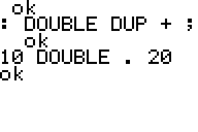
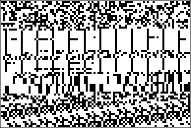
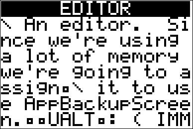

# Forth implementation for the TI-84+ calculator


## Why TI-84+?
This is a calculator that is more or less ubiquitous among high school
and university students throughout the world.  It's not going extinct
anytime soon (expect perhaps to newer models such as the TI-84 CE).
But let's face it.  TI-BASIC is not a nice language; it's slow and
suffers from lack of low-level bindings.  There's no REPL.  We want a
language that gives the programmer the full power of the
calculator—treating it as the computer it is.  In fact people already
do, by writing assembly programs, but assembly has its share of
disadvantages.

## Why Forth?
Assembly is painful to program in.  Programs crash at the slightest
hint of error.  Development is a slow process, and you have to keep
reinventing the wheel with each program.

Wouldn't it be great to have a programming language on the TI-84+
that's much faster than TI-BASIC but easier to understand and as low
level as assembly?  Forth is just that.  (Read _Starting FORTH_ for an
excellent introduction to Forth).  It's low level, it's simple, but
also _easy to type_, especially when you're on a calculator with a
non-QWERTY keyboard.  It is a very powerful language, allowing you to
do things like change the syntax of the language itself.  `IF`,
`WHILE`, `CONSTANT` etc. statements are all implemented in Forth!
Think of it as a untyped C with a REPL and the power of Lisp macros.

It's also easy to implement incrementally through continuous testing.
In fact, once the base REPL was implemented, most of the programming
and testing happened _on_ the calculator itself!

## Getting the interpreter
Download the latest binary from the
[Releases](https://github.com/siraben/ti84-forth/releases) page.

### The Real Thing
- A TI-84+ calculator!
- [TI Connect CE](https://education.ti.com/en/products/computer-software/ti-connect-ce-sw)
- (Optional) A 2.5 mm to 3.5 mm audio cable to connect the I/O port
  with a speaker.

Flash `forth.8xp` to your calculator.  Make sure there's enough space
and that you have backed up your calculator!  An easy way to back up
RAM contents is by creating a group, refer to the manual on how to do
this.

### Emulated
There are emulators ones for every platform, but in experience the
easiest one to get started with is
[jsTIfied](https://www.cemetech.net/projects/jstified/).  Read the
website's details for more information.  You'll need to obtain a ROM
image as well, which I can't provide here, but a simple web search
should lead you to find what you're looking for.
  
## Building
### Requirements
- [spasm-ng Z80 assembler](https://github.com/alberthdev/spasm-ng)
  - If you're on a Mac you may need to run the following commands.
```shell
brew install openssl
cd /usr/local/include
ln -s ../opt/openssl/include/openssl .
```
  - Compile the assembler with `make` (check required packages for
    your system).

Copy `forth.asm` into the cloned folder.  Then run:

```shell
./spasm forth.asm forth.8xp
```

Then flash.
## Using the Interpreter
First of all, you need to know how to type in the darn thing.
Simple.  Once you run the program with `Asm(prgmFORTH)`, hit `2nd`
then `ALPHA` to enter alpha lock mode, and now you can type the
characters from `A-Z`.  Here are a couple of things to keep in mind.

- Left and right arrows are bound to character delete and space insert
  respectively.
- Hitting `CLEAR` clears the current input line.
- Hitting `ENTER` sends it over to the interpreter.

If you want to see the keymap, find the label `key_table` in
`forth.asm`.  This table maps the keys received by `KEY` to the
appropriate character.

### Typing ASCII Characters
See the `2nd` or `ALPHA` key combos (in blue on the calculator) for
information on how to type the following characters: `[]{}"?:`.

| Character | Key Sequence  |
| :---:     | :---:         |
| `;`       | `2nd .`       |
| `!`       | `2nd PRGM`    |
| `@`       | `2nd APPS`    |
| `=`       | `2nd MATH`    |
| `'`       | `2nd +`       |
| `<`       | `2nd X,T,Θ,n` |
| `>`       | `2nd STAT`    |
| `\`       | `2nd ÷`       |
| `_`       | `2nd VARS`    |

## Exiting the Interpreter
Type `BYE` and hit `ENTER`.

## Loading Forth Programs onto the calculator
```shell
function fmake e {
    hexdump -e '".db "16/1 "$%02x, " "\n"' "$1" | sed 's/$  ,/$00,/g' | sed 's/.$//' | sed 's/$0a/$20/g' > "${1%.*}.asm" && ./spasm "${1%.*}.asm" "${1%.*}.8xp" && rm "${1%.*}.asm"
}
```
Once you defined this function in your shell you can just type `fmake
hello.fs` and transfer the compiled `hello.8xp` to the calculator.  To
load this file into the interpreter you have to run `LOAD HELLO` in
the Forth REPL.

## Features
- A 16-bit Forth on a 8-bit chip
  - Contains ~225 words (and counting) for everything from memory
  management to drawing pixels, de-compilation and even playing sounds
  over the I/O port.
- Support for writeback.  Use `SIMG` (save image) and `LIMG` (load
  image) to save the words you've defined in a session.

## Example Programs
See `programs/` for program samples, including practical ones.

## Available Words
```text
EXIT DUP + - AND OR XOR << >> INVERT DROP SWAP OVER ROT -ROT
2DROP 2DUP 2SWAP 1+ 1- 2+ 2- >R R> R@ 2>R 2R> RDROP 2RDROP LIT
LITSTR S" .Q TELL STRLEN STRCHR !  @ +!  -!  C!  C@ C@C!  CMOVE
EXECUTE BASE PREC STATE LATEST SP0 [ ] ?SE HERE DOCOL BUF BUFSZ WBUFP
WBUF WBUFSZ RP0 H0 F_IMMED F_HIDDEN F_LENMASK SCR ABS PLOTSS ' , C,
SP@ SP!  RP@ RP!  BRANCH 0BRANCH ?DUP = <> >= <= < > 0= KEY KEYC EMIT
T.  ?  AKEY TO_ASCII * /MOD SQRT 0 1 2 3 4 5 6 7 8 9 10 FRAND F.
FREAD F* FSQUARE F= FDUP FDROP FSWAP F+ F/ FRCI F- FSQRT MD5 D/MOD UM*
D+ M+ DS SPACE CR AT-XY PUTS PUTLN GETS GETC UNGETC WORD ?IMMED IMMED
>NFA >CFA STR= FIND WB USED SIMG LIMG >DFA CREATE DOCOL_H : ; (DOES>)
DOES> PAGE HIDDEN ?HIDDEN MOD / NEGATE TRUE FALSE NOT LITERAL NIP TUCK
ID.  HIDE IF THEN ELSE BEGIN UNTIL AGAIN WHILE REPEAT CHAR (COMP)
CONST ALLOT CELLS RECURSE VAR DO LOOP +LOOP FORGET '0' '9' WITHIN NUM?
NUM CFA> PICK U.  UWIDTH SPACES U.R U.  .  DEPTH .S HEX DEC SEE WORDS
CASE OF ENDOF ENDCASE I J CSCR CBLK FBLK RUN LOAD SMIT PLOT WR PN BYE
STAR
```
Note that floating point routines are commented out by default to save on space.

## Screenshots
### Combine words in powerful, practical ways
Combine low-level memory words with drawing words and user input words
to create an arrow-key scrollable screen for viewing RAM memory.  See
the 20 (or less) lines of code at `programs/memview.fs`.



### TI-84+ inside


### Load programs
Simple unfinished modal text editor with a scrollable screen.



## Design Notes
### Use of Macros
Judicious use of macros has greatly improved readability of the code.
This was directly inspired by the _jonesforth_ implementation (see
Reading List).
### Register Allocation
One notable feature of this Forth is the use of a register to keep
track of the top element in the stack.

| Z80 Register | Forth VM Register             |
| :---:        | :---:                         |
| DE           | Instruction pointer (IP)      |
| HL           | Working register (W)          |
| BC           | Top of stack (TOS)            |
| IX           | Return stack pointer (RSP)    |
| SP           | Parameter stack pointer (PSP) |

### Reading List
Documentation can vary from very well-documented to resorting to
having to read the source code of `spasm-ng` to figure out how
`#macro` worked.  See examples such as `defcode` and `defword`.  I
couldn't make `defconst` or `defvar`, however, but this was fixed by
writing it out manually.

- [General Z80 guide](http://jgmalcolm.com/z80/#advanced)
- [Moving Forth](http://www.bradrodriguez.com/papers/moving1.htm)
- [Learn TI-83 Plus Assembly In 28 Days](http://tutorials.eeems.ca/ASMin28Days/welcome.html)
- [KnightOS Kernel](https://github.com/KnightOS/kernel)
- [Starting FORTH](https://www.forth.com/starting-forth/)
- [Jonesforth](http://git.annexia.org/?p=jonesforth.git)

## To be Implemented
- [x] Ability to read/write programs
  - [x] `WB` word to writeback ~~2048~~ 400 (see *Current Limitations*)
         bytes of data starting from the address of `SCRATCH`.
  - [x] Ability to "execute" strings (so that programs can be
        interpreted).
- [x] User input
  - [x] String reading routines
  - [x] Number reading routines (possible with `programs/number.fs`)
- [x] Output
  - [x] Displaying strings
- [x] Proper support for compile/interpret mode
- [x] Assembler to convert Forth words into `.dw` data segments to be
pasted into the program.
- [x] Ability to switch to a "plot"
- [x] REPL
  - [x] Basic Read/Eval/Print/Loop
  - [x] Allowing more than one word at a time input
  - [x] Respect hidden flag to avoid infinite looping. (`:` makes the
        word hidden).
  - [x] Reading numbers (support for 0-10 inclusive hardcoded, but not
        a general algorithm).  See `programs/number.fs`
- [ ] Document Forth words (partially done)
- [ ] Add Z80 assembler in Forth (so ASM programs can be made!)
- [x] Implement `DOES>`
- [x] Implement `SIMG` (save image) and `LIMG` (load image) to save
      and load sessions.
- [x] Add sound capabilities
- [x] Add a way to put data on the screen as pixels (for export via
      screenshots).
- [ ] Add computer program to allow the user to select the words for a
      custom Forth system.

## Current Limitations
- [x] REPL prints out "ok" at the end of each word parsed, `QUIT` not
      implemented.
- [ ] Indirect threading means we cannot use scratch space in addreses
      higher than `$C000` as if the program counter exceeds `$C000` it
      crashes the OS.
