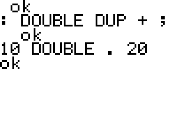
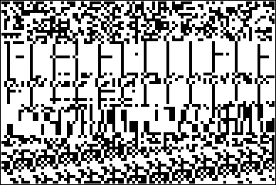
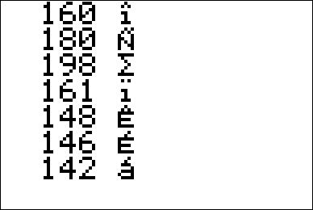
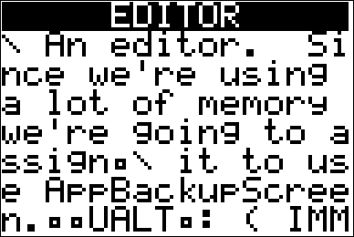

# Forth implementation for the TI-84+ calculator


## Features
- A 16-bit Forth on an 8-bit chip
  - Contains over 200 words for everything from memory
  management to drawing pixels, decompilation, and even playing sounds
  over the I/O port.
- Support for writeback (persistent data across program runs). Use
  `SIMG` (save image) and `LIMG` (load image) to save the words you've
  defined in a session.
- Highly readable and customizable implementation, see `forth.asm`.

## Getting the interpreter
Download the latest binary from the
[Releases](https://github.com/siraben/ti84-forth/releases) page or get
the bleeding edge output from the [GitHub Actions
CI](https://github.com/siraben/ti84-forth/actions).

### The Real Thing
- A TI-84+ calculator!
- [TI Connect CE](https://education.ti.com/en/products/computer-software/ti-connect-ce-sw)
- (Optional) A 2.5 mm to 3.5 mm audio cable to connect the I/O port
  with a speaker.

Flash `forth.8xp` to your calculator. Make sure there's enough space
and that you have backed up your calculator! An easy way to back up
RAM contents is by creating a group, refer to the manual on how to do
this.

## Why TI-84+?
This is a calculator that is more or less ubiquitous among high school
and university students throughout the world. It's not going extinct
anytime soon (except perhaps to newer models such as the TI-84 CE).
But let's face it. TI-BASIC is not a nice language; it's slow and
suffers from lack of low-level bindings. There's no REPL. We want a
language that gives the programmer the full power of the
calculator—treating it as the computer it is. In fact, people already
do, by writing assembly programs, but assembly has its share of
disadvantages.

## Why Forth?
Assembly is painful to program in. Programs crash at the slightest
hint of error. Development is a slow process, and you have to keep
reinventing the wheel with each program.

Wouldn't it be great to have a programming language on the TI-84+
that's much faster than TI-BASIC but easier to understand and as low
level as assembly? Forth is just that. (Read _Starting FORTH_ for an
excellent introduction to Forth). It's low level, it's simple, but
also _easy to type_, especially when you're on a calculator with a
non-QWERTY keyboard. It is a very powerful language, allowing you to
do things like change the syntax of the language itself. `IF`,
`WHILE`, `CONSTANT` etc. statements are all implemented in Forth!
Think of it as an untyped C with a REPL and the power of Lisp macros.

It's also easy to implement incrementally through continuous testing.
In fact, once the base REPL was implemented, most of the programming
and testing happened _on_ the calculator itself!

## Building
### Nix
```sh
nix build
```
### Mac/Linux
- [spasm-ng Z80 assembler](https://github.com/alberthdev/spasm-ng)
  - If you're on a Mac, you will need to install `openssl` as a
    dependency, for instance on Homebrew:
```shell
brew install openssl
cd /usr/local/include
ln -s ../opt/openssl/include/openssl .
```
  - Compile the assembler with `make` (check required packages for
    your system).

Copy `forth.asm` into the cloned folder. Then run:

```shell
./spasm forth.asm forth.8xp
```

### Emulated
The implementation is regression-tested with headless TilEm and a TI-84 Plus
OS 2.55MP ROM. ROM images are copyrighted and are not included. To launch the
assembly payload correctly, load both `FORTH.8xp` and a BASIC wrapper whose
body is `Asm(prgmFORTH)`; running the assembly variable as BASIC produces
`ERR:SYNTAX`.

## Using the Interpreter
Run the program with `Asm(prgmFORTH)`, hit `2nd` then `ALPHA` to enter
alpha lock mode, and now you can type the characters from `A-Z`. Here
are a couple of things to keep in mind.

- Left and right arrows are bound to character delete and space insert
  respectively.
- Hitting `CLEAR` clears the current input line.
- Hitting `ENTER` sends it to the interpreter, including while alpha mode or
  alpha lock is active.
- Input lines contain at most 63 characters. Longer keypresses are ignored so
  the 64-byte buffer always remains NUL-terminated.
- `ok` is printed when the interpreter needs a new input line, not after every
  individual word on a line.

If you want to see the keymap, find `key_table` in `forth.asm`. `KEY` returns
the cooked TI OS `_GetKey` code; `AKEY`, `GETS`, and `TO_ASCII` use the table to
map supported codes to ASCII. `KEYC` is the nonblocking raw-scan-code interface
provided by `_GetCSC` and must not be passed to `TO_ASCII`.

### Typing ASCII Characters
See the `2nd` or `ALPHA` key combos (in blue on the calculator) for
information on how to type the following characters: `[]{}"?:`.

| Character | Key Sequence  |
| :---:     | :---:         |
| `;`       | `2nd .`       |
| `!`       | `2nd PRGM`    |
| `@`       | `2nd APPS`    |
| `=`       | `2nd MATH`    |
| `'`       | `2nd +`       |
| `<`       | `2nd X,T,Θ,n` |
| `>`       | `2nd STAT`    |
| `\`       | `2nd ÷`       |
| `_`       | `2nd VARS`    |

## Exiting the Interpreter
Type `BYE` and hit `ENTER`.

## Loading Forth Programs onto the Calculator

Use the provided `fmake.py` script to convert Forth source files to the TI-84+ executable format.

Run the script to generate the assembly file:

```sh
python3 fmake.py hello.fs
```

To also assemble it to a `.8xp` executable, add the `--assemble` flag:

```sh
python3 fmake.py hello.fs --assemble
```

`spasm` must be on `PATH` for `--assemble` (the Nix development shell supplies
both Python and spasm-ng). spasm-ng intentionally exports these byte streams as
protected program variables; `FBLK` and `LOAD` accept both normal and protected
programs. TI names are limited to eight characters, so keep the source basename
to eight alphanumeric characters. The source variable must be in RAM; unarchive
it before loading because the current input stream does not page archived data
into the address space. Transfer the `.8xp` with TI Connect CE and run `LOAD
HELLO` in the Forth REPL.

## Example Programs
See `programs/` for program samples, including practical ones.

## Available Words

See [DOCUMENTATION.md](DOCUMENTATION.md) for the supported interfaces and their
nonstandard details. `WORDS` prints the live dictionary on the calculator.
Commented-out experiments in `forth.asm` (including floating-point and MD5
code) are not available words.

## Screenshots
### Combine words in powerful, practical ways
Combine low-level memory words with drawing words and user input words
to create an arrow-key scrollable screen for viewing RAM memory. See
the 20 (or less) lines of code at `programs/memview.fs`.



### TI-84+ inside


### Load programs
Simple unfinished modal text editor with a scrollable screen.



## Design Notes
### Use of Macros
Judicious use of macros has greatly improved the readability of the code.
This was directly inspired by the _jonesforth_ implementation (see
Reading List).
### Register Allocation
One notable feature of this Forth is the use of a register to keep
track of the top element in the stack.

| Z80 Register | Forth VM Register             |
| :---:        | :---:                         |
| DE           | Instruction pointer (IP)      |
| HL           | Working register (W)          |
| BC           | Top of stack (TOS)            |
| IX           | Return stack pointer (RSP)    |
| SP           | Parameter stack pointer (PSP) |

### Memory layout and persistence

- The OS copies the assembly payload to `userMem` (`$9D95`). The current build
  has `data_start=$BA3B` and `data_end=$BB9D`, leaving `$0463` (1,123) bytes
  before `$C000`. That headroom is build-dependent and is not part of the
  persistent 350-byte reservation. `$C000` is the execution-protection
  boundary for the normal TI-84 Plus RAM mapping, not a claim that RAM ceases
  to exist.
- The parameter stack uses the OS stack. The return stack uses 294 bytes at
  `$91DC..$9301`, immediately below `plotSScreen`; this is OS scratch workspace
  and is safe only while the assembly program owns the machine.
- `SCR`/`HERE` starts at `data_start`. Exactly 350 bytes are reserved for user
  dictionary data, followed by the two-byte saved `LATEST` and two-byte saved
  `HERE` fields. Consequently `WB`, `SIMG`, and `LIMG` persist 354 bytes—not
  400. Dictionary-space exhaustion is not currently checked.
- `ABS` is `appBackUpScreen` (`$9872`, 768 bytes), `PLOTSS` is
  `plotSScreen` (`$9340`, 768 bytes), and `UALT` redirects `HERE` to
  `appBackUpScreen`. These regions are OS scratch buffers, not permanent
  storage.

The active OS calls are standard TI-83+/84+ bcalls: `_GetKey`, `_GetCSC`,
`_PutC`, `_PutS`, `_NewLine`, `_ClrLCDFull`, `_ChkFindSym`, `_CreateProg`, and
the writeback/variable routines. Their equates match the TI-84 Plus include
tables and were dynamically exercised on OS 2.55MP.

### Reading List
Documentation can vary from very well-documented to resorting to
having to read the source code of `spasm-ng` to figure out how
`#macro` worked. See examples such as `defcode` and `defword`. I
couldn't make `defconst` or `defvar`, however, but this was fixed by
writing it out manually.

- [General Z80 guide](http://jgmalcolm.com/z80/#advanced)
- [Moving Forth](http://www.bradrodriguez.com/papers/moving1.htm)
- [Learn TI-83 Plus Assembly In 28 Days](http://tutorials.eeems.ca/ASMin28Days/welcome.html)
- [KnightOS Kernel](https://github.com/KnightOS/kernel)
- [Starting FORTH](https://www.forth.com/starting-forth/)
- [Jonesforth](http://git.annexia.org/?p=jonesforth.git)

## To be Implemented
- [x] Ability to read/write programs
  - [x] `WB` word to write back the 354-byte persistent data segment
         bytes of data starting from the address of `SCRATCH`.
  - [x] Ability to "execute" strings (so that programs can be
        interpreted).
- [x] User input
  - [x] String reading routines
  - [x] Number reading routines (possible with `programs/number.fs`)
- [x] Output
  - [x] Displaying strings
- [x] Proper support for compile/interpret mode
- [x] Assembler to convert Forth words into `.dw` data segments to be
pasted into the program.
- [x] Ability to switch to a "plot"
- [x] REPL
  - [x] Basic Read/Eval/Print/Loop
  - [x] Allowing more than one word at a time input
  - [x] Respect hidden flag to avoid infinite looping. (`:` makes the
        word hidden).
  - [x] Reading unsigned decimal numbers modulo 16 bits
- [ ] Document Forth words (partially done)
- [ ] Add Z80 assembler in Forth (so ASM programs can be made!)
- [x] Implement `DOES>`
- [x] Implement `SIMG` (save image) and `LIMG` (load image) to save
      and load sessions.
- [x] Add sound capabilities
- [x] Add a way to put data on the screen as pixels (for export via
      screenshots).
- [ ] Add computer program to allow the user to select the words for a
      custom Forth system.
- [x] Implement `extract.py` to extract and decode binary data from a PNG image, allowing analysis and debugging of the stored image data.

## Current Limitations

- Dictionary allocation has no bounds check. The reserved persistent scratch
  area is 350 bytes and the current image has additional headroom before
  `$C000`, but compiled threaded code must remain below the protected boundary.
- Comparisons and division are unsigned. `WITHIN` includes both endpoints, and
  `+LOOP` terminates on equality rather than standard boundary crossing.
- `QUIT` resets the parameter stack and resumes the terminal; it does not
  unwind or validate arbitrary return-stack corruption.
